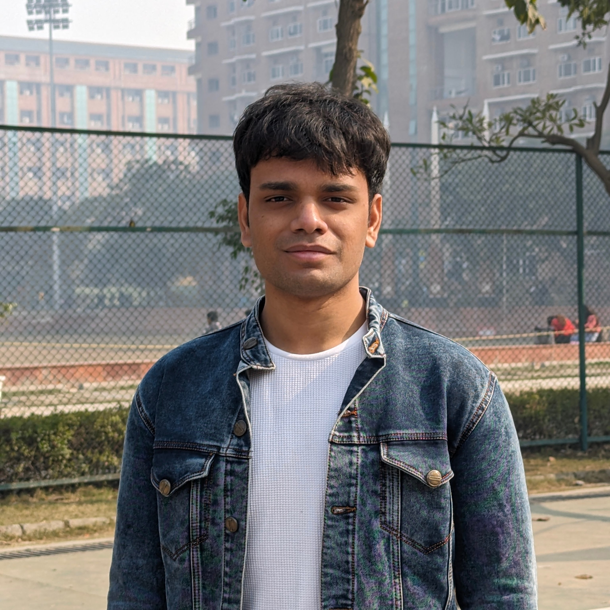

## About me

Greetings to everyone visiting my page!

This is me Yusuf Jamal. I am Computer (Science and) Engineering student from Delhi, India and this is my Github profile.

I have many interests but two particularly stand out to most people that get to know me - Computer Science and Philosophy. I have been studying Computer Science from a university in India for less than 2 years now and hope to graduate by the end of 2024 or the start of 2025.

## Projects

I have worked on several projects throughout my journey on Github so I am going to list some of the remarkable ones

### Android Apps

- [JADA](github.com/sbeve72/JADA)
    
    Although discontinued, JADA was one of my favorite apps that I had made. It was a beautiful and easy-to-use dictionary app.

- [Cloudzy](github.com/sbeve72/Cloudzy)

    Just like JADA, Cloudzy is another beautiful Android application that I made with a friend @danielmbutler from the UK. This was my first Android app to go to the playstore.

### Discord Bots

- [Rel Bot](github.com/sbeve72/rel-bot)

    Rel or r/EnglishLearning is a Reddit community for which I made a Discord server about 4 years ago in May, 2019. While I don't own the server belonging to the community anymore, I do have a great admiration for its inclusive nature. As such, me and my co-developers @ShaunB21 and @Savolainen5 decided to make a Discord bot to automate some of the repetitive tasks the moderators found themselves doing a lot.

...to be continued
